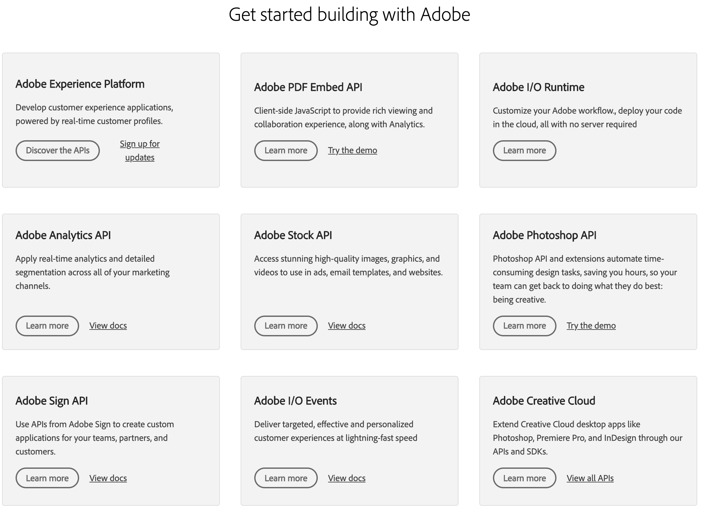

<Hero slots="heading, text, buttons"/>

# Adobe Developers!

We're counting on you to build the most compelling experiences using our world-class Creative, Document, and Experience Cloud APIs.

* [See somthing cool](https://adobe.io)
* [Sign up for a newsletter](https://adobe.io)

<AnnouncementBlock slots="heading, text, buttons" />

### Adobe MAX—The Creativity Conference, October 20–22

All together now. All around the world. (A spot for temporal events like Summit, Magento Imagine, MAX)

Make plans to join us for a uniquely immersive and engaging digital experience, guaranteed to inspire. Three full days of luminary speakers, celebrity appearances, musical performances, global collaborative art projects, and 350+ sessions — and all at no cost.

Register now to build your schedule and get sponsor giveaways.

[MAX Developer-specific CTA](https://portal.adobe.com/pages/adobe/am20/signin)

<TextBlock slots="image, heading, text1, text2, links" />

### Creative Cloud's Dev Feature

Extend Creative Cloud desktop apps like [Photoshop](https://www.adobe.com/products/photoshop.html), [Premiere Pro](https://www.adobe.com/products/premiere.html), and [InDesign](https://www.adobe.com/products/indesign.html) through our APIs and SDKs.
Be sure to check out [Common Extensibility Platform (CEP)](https://www.adobe.io/apis/creativecloud/cep.html), which lets you build custom UI panels for multiple CC apps at once.

When you're ready to ship, distribute your work on [Adobe Exchange](https://exchange.adobe.com/), the preferred marketplace for Adobe Creative Cloud users.
And be sure to join the [Exchange Program for Creative Cloud](https://partners.adobe.com/exchangeprogram/creativecloud) to unlock more benefits, including streamlined publishing and promotional opportunities.

*  [Adobe Premiere Pro](https://www.adobe.com/products/premiere.html)
*  [Adobe InDesign](https://www.adobe.com/products/indesign.html)
*  [Adobe After Effect](https://www.adobe.com/products/aftereffects.html)

<TextBlock slots="heading, text, buttons, links, image"/>

### Document Cloud's Dev Feature

Create plugins for Adobe XD that push the boundaries of experience design by adding new features to the app, automating workflows, connecting XD to external services, and more—all on a quick, modern JavaScript engine with native UI components.
When you’re ready, you can ship your plugin to XD users right from within the app.

* [Get started](https://adobe.io)
* [Sign up for the newsletter](https://adobe.io)

- [No Icon Product](https://www.adobe.com/products/premiere.html)

<TitleBlock slots="heading, text" theme="light" />

### Experience Cloud's Dev Feature

With the Experience of a lifetime, something something

<SummaryBlock slots="image" />

